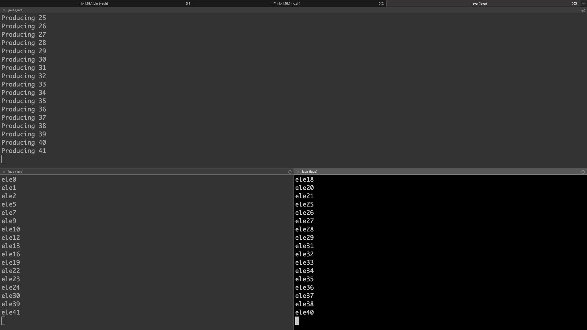
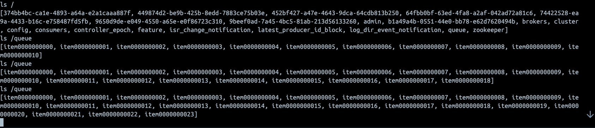

# Distributed Queue

Distributed queue implemented using zookeeper.
## Running Instructions

1. Build the jar using maven:
    ```
    mvn clean package
    ```

2. Run the consumers in 2 separate terminals using:
    ```
    java -cp target/queue-1.0-SNAPSHOT-jar-with-dependencies.jar org.example.tester.Consumer   
    ```
   
3. Run the producer using:
    ```
    java -cp target/queue-1.0-SNAPSHOT-jar-with-dependencies.jar org.example.tester.Producer   
    ```


## Example run 
Sample run with 1 producer(top half) and 2 consumers(bottom half) on the queue reading mutually exclusive items



## State in zookeeper

Queue maintained in zookeeper as Persistent Sequential nodes to maintain FIFO order as children of `/queue` node.



## How it works?

The distributed queue implementation uses the DistributedLock, which is also maintained in zookeeper.

### Distributed Lock

1. Distributed Lock is implemented by creating a child under `/lock/queue` which acts as a distributed lock on `/queue`. 
2. When a machine in a cluster tries to acquire a lock, it creates `SEQUENTIAL` zookeeper node as a child of  `/lock/queue` as a proposal.  
3. Then the machine sends a get query for all the children of `/lock/queue` to zookeeper and sorts them.
4. Now, since they are created as a SEQUENTIAL zookeeper node, the node created first will have a smaller sequence number if nodes are created concurrently.
5. Now, there are 2 cases:

   a. If the first node in the children is the one just created, the lock is said to be acquired.

   b. If the first node is sorted order is not the one it just created, the created node will be deleted.
6. If the lock is acquired, we return true from the `lock()` method and call `unlock()` after the work is done to delete this node.

NOTE: The children of `/lock/node` are creates as `EPHEMERAL` nodes so that, the lock is released if a machine goes down. 

P.S.: The term `node` is used to describe zookeeper node and the term `machine` is used for nodes in the cluster to avoid confusion.

### Distributed Queue

1. Distributed Queue is implemented by created a `SEQUENTIAL` child under `/queue` node which acts as a datastore for the item enqueued.
2. It is created as `SEQUENTIAL` node to maintain FIFO order and `PERSISTENT` node to preserve data in case the producer fails.
3. `enqueue()` works without locking as the queue is assumed to be unbounded, and hence doesn't affect other producer or consumer threads.
4. `dequeue()` acquires a lock before dequeueing to make sure that items are removed in FIFO order from the queue and there is mutual exclusivity in the item being dequeued(point-to-point model).


## TODO

1. Optimise the non acquisition of lock with watcher to remove busy waiting.
